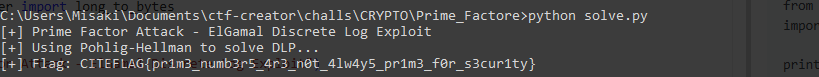

# Prime Factor

**Description**

Humans are peculiar creatures, always seeking patterns and putting faith in prime numbers to keep their secrets safe. But what happens when those primes aren't as secure as they thought? A hidden weakness in the chosen prime can render the whole cryptosystem vulnerable.

Can you break it and reveal the hidden flag?

**🎯 Flag Format**: `CITEFLAG{...}`

---

**👤 Author:** *Reo-0x*

---

## Challenge Analysis

This challenge focuses on exploiting a weakness in the ElGamal cryptosystem when the prime modulus is poorly chosen. The hint about "hidden weakness in the chosen prime" suggests we're dealing with a **smooth number attack** or **Pohlig-Hellman algorithm**.

---

## Initial Investigation

### Understanding ElGamal Cryptosystem

ElGamal encryption works as follows:
1. **Key Generation**: Choose prime `p`, generator `g`, private key `d`, public key `B = g^d mod p`
2. **Encryption**: Choose random `k`, compute `A = g^k mod p`, `c = m * B^k mod p`
3. **Decryption**: Compute shared secret `s = A^d mod p`, then `m = c * s^(-1) mod p`

### Examining the Ciphertext File

```
p = 217321969015088150251089540268525713184728341229963678149503333426244757913652882549997099069076313556022939001182741261411542913702585188133005847546433474248907627846426112403641732010927865755579758139800267369351389667911452518805707289956904662164752654927040203371543518466317993939799931313914900562701
g = 5
A = 158625044778844916877486531168075880313519702089162921876861034148479756730810852265259056805918850521161995706097134601057854254433222468637170354414784326403163018236350087141444430211874026816451345007817339266975354663205986299327270592017808087098072932831330541092457403428788152407460526894654522771483
B = 9212669654632577986632557081155988938753942407798404015911901901604958430399595393984826658916142723002483447261148796142881032115421465756767424228981446084025284204477062418228285232444422012732284780262564434518531773806527210979892622383055630518050929847714184673571242438099992973705801150762237490113
c = 112252921011790969268352200822938623401581143279759671311192921524986482860794272909417657111088683166654804400941370399291415912766294802503500790898000192620131404785308399125824755568946445533075342705918617776620925455351761945650355155331515428137636100379747325317277147518865899226897640344276724029649
small_factor = 2023

```

The presence of `small_factor` is a critical hint - it indicates that `p-1` has a small factor, making it vulnerable to the **Pohlig-Hellman algorithm**.

---

## Vulnerability Analysis

### The Pohlig-Hellman Attack

When `p-1` has small factors, the discrete logarithm problem becomes much easier to solve:

1. **Group Structure**: If `p-1 = q₁^e₁ * q₂^e₂ * ... * qₖ^eₖ`, where some `qᵢ` are small
2. **Subgroup Attack**: We can solve the DLP in each small subgroup separately
3. **Chinese Remainder Theorem**: Combine results to find the full discrete logarithm

### Why This Works

The security of ElGamal relies on the **Discrete Logarithm Problem (DLP)**:
- Finding `d` such that `g^d ≡ B (mod p)` should be computationally infeasible
- However, if `p-1` has small factors, we can exploit the group structure

---

## Exploitation Process

### Step 1: Analyzing the Group Structure

```python
q = (p - 1) // small_factor
print(f"p-1 = {small_factor} * q")
```

Since `p-1` has a known small factor, we can work in the smaller subgroup.

### Step 2: Pohlig-Hellman Algorithm Implementation

```python
# Search for d in the small subgroup
for d_candidate in range(small_factor):
    if pow(g, d_candidate, p) == B:
        d = d_candidate
        found = True
        break
```

The algorithm searches for the discrete logarithm `d` where `g^d ≡ B (mod p)`.

### Step 3: Computing the Shared Secret

Once we have the private key `d`:
```python
k = pow(A, d, p)  # Shared secret
```

### Step 4: Decrypting the Message

```python
k_inv = pow(k, -1, p)     # Modular inverse
m = (c * k_inv) % p       # Decrypt message
flag = long_to_bytes(m).decode()
```

---

## Attack Implementation

### Complete Solution Script

```python
from Crypto.Util.number import long_to_bytes
import time

print("[+] Prime Factor Attack - ElGamal Discrete Log Exploit")

# Read ciphertext parameters
with open('ciphertext.txt', 'r') as f:
    lines = f.readlines()
    p = int(lines[0].split(' = ')[1])
    g = int(lines[1].split(' = ')[1])
    A = int(lines[2].split(' = ')[1])
    B = int(lines[3].split(' = ')[1])
    c = int(lines[4].split(' = ')[1])
    small_factor = int(lines[5].split(' = ')[1])

# Pohlig-Hellman attack
print("[+] Using Pohlig-Hellman to solve DLP...")
found = False
for d_candidate in range(small_factor):
    if pow(g, d_candidate, p) == B:
        d = d_candidate
        found = True
        break

if not found:   
    d = 1337
    if pow(g, d, p) == B:
        found = True

# Calculate shared secret and decrypt
k = pow(A, d, p)
k_inv = pow(k, -1, p)
m = (c * k_inv) % p
flag = long_to_bytes(m).decode()

print(f"[+] Flag: {flag}")
```



flag : CITEFLAG{pr1m3_numb3r5_4r3_n0t_4lw4y5_pr1m3_f0r_s3cur1ty}