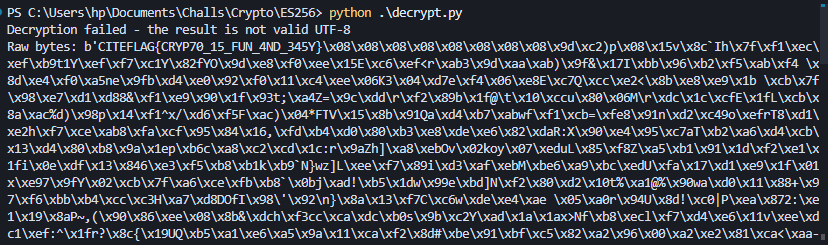

**Description**

We've intercepted a secret message that was encrypted with an unknown algorithm. Luckily, we also managed to recover the encryption key: `CITEFLAG`.

---

**👤 Author:** *xtle0o0*

---

The challenge is called "xES 256", which hints at a play on words—perhaps referencing AES or DES. Upon closer inspection, the encryption actually uses DES (Data Encryption Standard), not AES.

The twist: the message wasn't just encrypted once, but 256 times in a row using DES with the same key. To recover the original message, you need to decrypt the ciphertext 256 times, each time using DES and the provided key.

