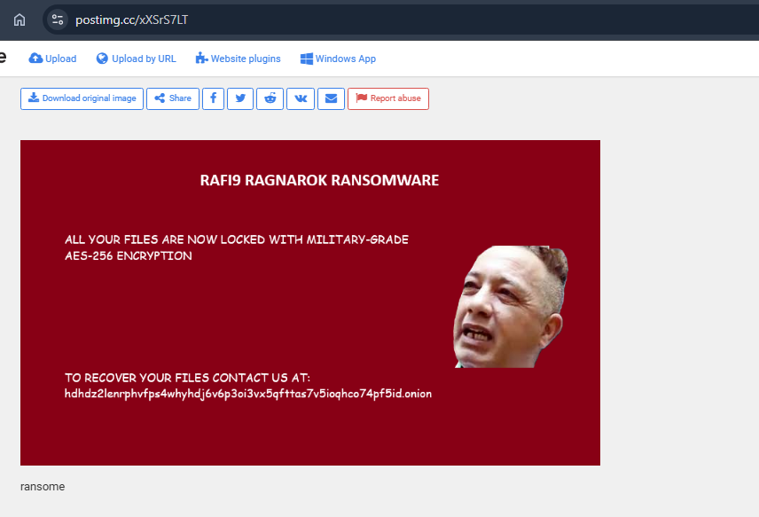
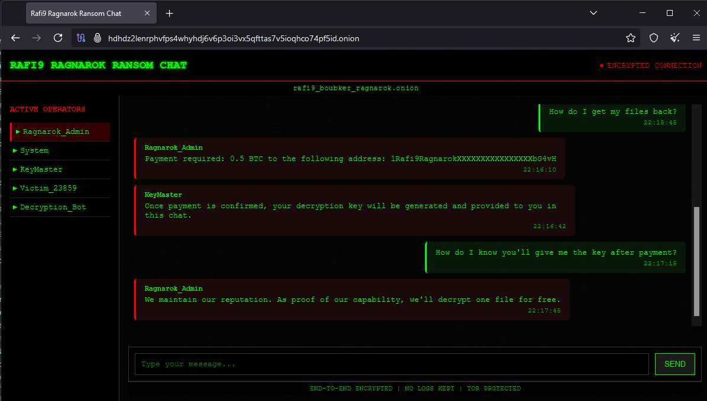
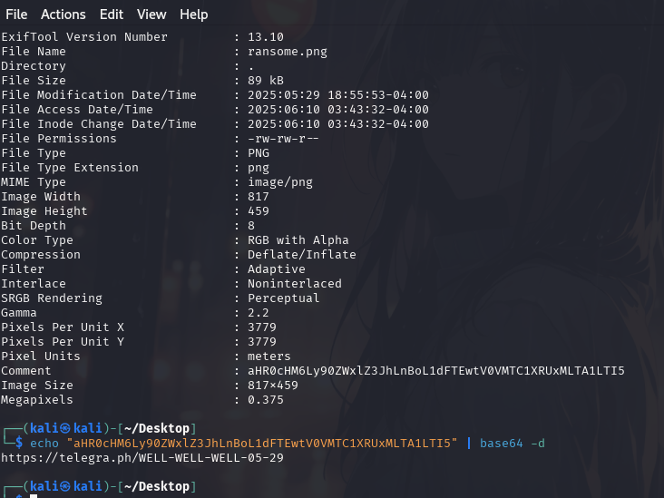

**Description**

A major security breach has struck a prominent cybersecurity firm. Network logs reveal suspicious communications between two employees that started as plaintext conversations before suddenly switching to encrypted channels. Shortly after, critical systems were locked down by the mysterious “rafi9boubkerragnarok” ransomware.

> Your mission is to uncover how trusted insiders became the ultimate threat.
> Follow the digital breadcrumbs, break their secure communications, and reverse the destructive payload they unleashed.

**🎯 Flag Format**: `CITEFLAG{...}`

---

**👤 Author:** *xtle0o0*

---

## Initial Observations

From the description, we understand that two threat actors started conversing in an unencrypted channel, then switched to an encrypted method. basic analysis revealed a chat between 192.168.10.129 and 192.168.10.128:

```text
LEO: Suuup

REO: fain, lkhawa tl3oli f rasi dik charika, chbanlek nsardolom rafi9ragnarok

LEO: Ser hhhhhhh, doz doz n ghosty 8f2a1d4b6e3c7f9a0b5c2d1e4f6a8b0c9d2e4f6a8b0c2d1e

REO: OK
```

As noted, they switched to encrypted chat. The string

```
8f2a1d4b6e3c7f9a0b5c2d1e4f6a8b0c9d2e4f6a8b0c2d1e
```

appears to be a symmetric key for their encrypted communications.

---

## Packet Capture Analysis

Using Wireshark filter

```
tcp && ((ip.src == 192.168.10.128 && ip.dst == 192.168.10.129) || (ip.src == 192.168.10.129 && ip.dst == 192.168.10.128))
```

we found:

* **Port 6699**: plaintext chat
* **Port 69**: encrypted channel
* **Port 96**: encrypted channel

---

## Decryption Approach

Based on the shared key, it’s likely they used AES (symmetric). We tried:

1. **AES decryption** on ports 6699 and 96
2. IV set to `00000000000000000000000000000000`
3. Key: `8f2a1d4b6e3c7f9a0b5c2d1e4f6a8b0c9d2e4f6a8b0c2d1e`

After decryption, port 69 traffic revealed:

```
===== PORT 69 COMMUNICATIONS =====

192.168.10.128 → 192.168.10.129: LEO: Here we go, mohim ankhdmo b Macro-Based Ransomware ana ghansaredlek docm file nta 9ad fishing mail
192.168.10.129 ← 192.168.10.128: REO: Ok ser
```

Port 96 revealed a `.docm` file transfer:

```
===== PORT 96 COMMUNICATIONS =====

192.168.10.128 → 192.168.10.129: rafi9.docm
```

We extracted **rafi9.docm** from the capture.

---

## Macro Analysis

Using `olevba` on **rafi9.docm**:

```bash
olevba rafi9.docm
```

Key findings:

* **AutoOpen** triggers `BeginRagnarok`
* Base64-encoded AES key (SecretKeyForBase64Encode) and IV (InitVector123456)
* Powershell script to encrypt `.docx`/`.xlsx` files via AES in `C:\Users\Public\Documents`
* Download ransom-note wallpaper from a given URL
* Additional persistence (keylogger, WMI event subscription, ...)

---

## Ransom Note & Dark Web Link

The macro sets a ransom note wallpaper. The note contains a Dark Web link:

```
hdhdz2lenrphvfps4whyhdj6v6p3oi3vx5qfttas7v5ioghco74pf5id.onion
```

Accessing that site and inspecting the site reveals:



---

## Site Interaction & Metadata

Looking at the page source or messing with the site doesn’t reveal the flag :



The flag was hidden in the metadata of the ransom note wallpaper hhhhhhhhhh:



---

## Flag Extraction

On the Telegraph note we find a Base64 string:

```bash
echo "Q0lURUZMQUd7M1gxRl9EME5UX0wxM19SNEYxOV9XNDVfSDNSM30=" | base64 -d
```

Which decodes to:

```
CITEFLG{3X1F_D0NT_L13_R4F19_W45_H3R3}
```

