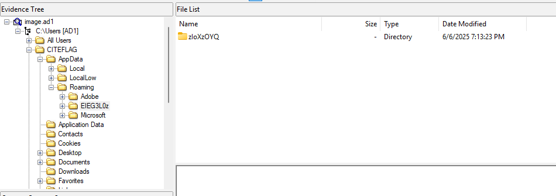
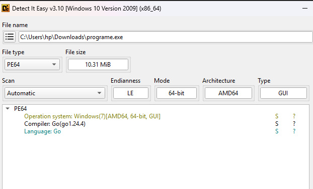
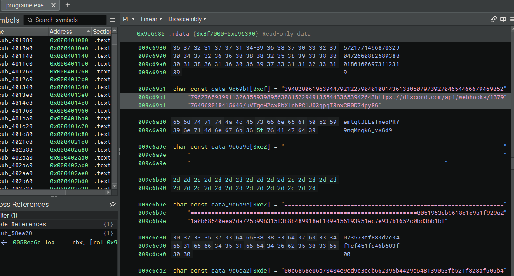
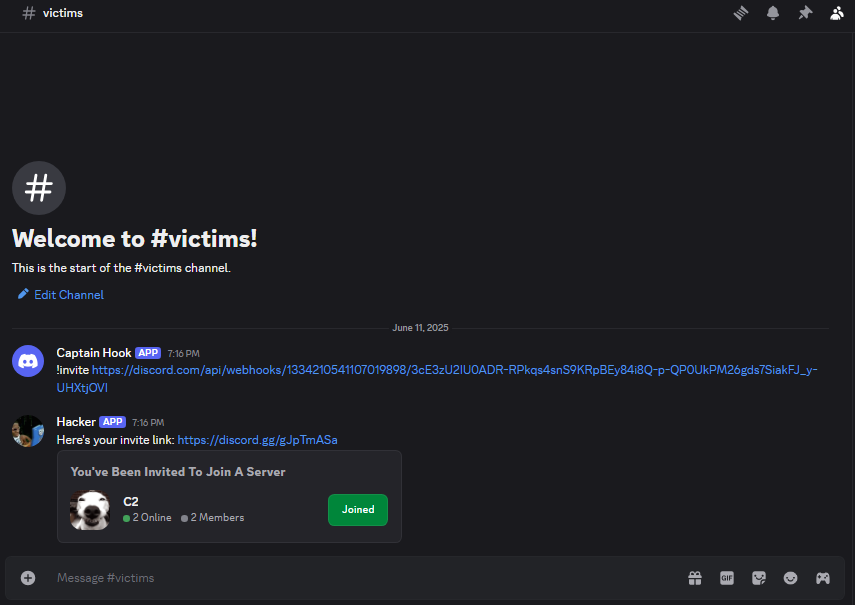
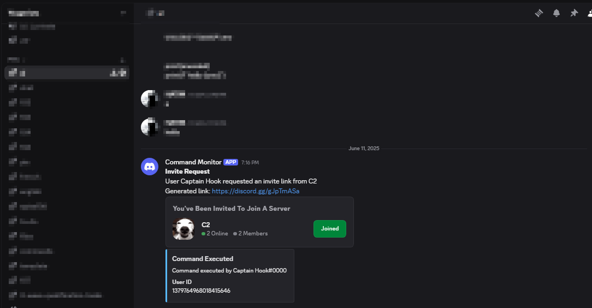
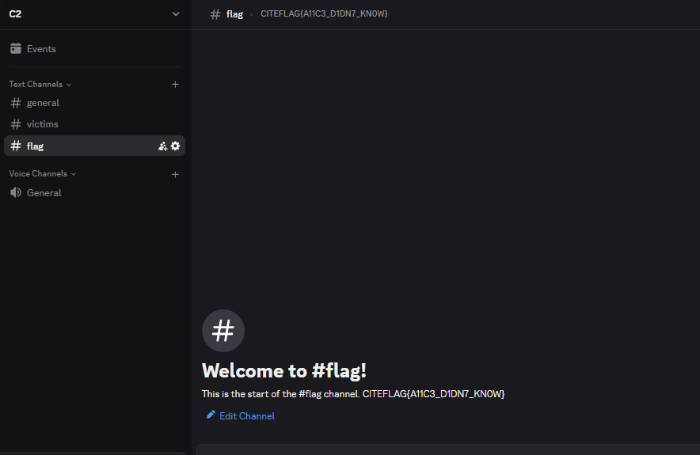

**Description**

AcmeCorp’s security team has just discovered a serious breach. An unsuspecting employee, Alice, found a mysterious USB stick in the break room one morning and plugged it into her work desktop. Unbeknownst to her, this was no ordinary USB drive—instead, it silently deployed a small “dropper” binary that reached out to a remote server, downloaded a sophisticated stealer payload, and installed it on her machine. The stealer promptly began exfiltrating sensitive credentials and corporate documents back to the attacker’s infrastructure.

Your mission is to investigate, trace the attacker’s infrastructure, and retrieve the secret flag.

> 🚨 **NOTE**: Once you uncover the method the attacker used to send data to their infrastructure, open a ticket on Discord.

🎯 **Flag Format**

```
CITEFLAG{....}
```

https://www.mediafire.com/file/mln0nqinstp4j0n/Archive.rar/file

---

👤 **Author**: xtle0o0

---

### Key Takeaways from the Description

* A dropper downloaded a stealer and installed it on Alice’s machine.
* The stealer exfiltrated data and sent it to the attacker’s infrastructure.

---

### Investigation Steps

1. **Disk Image Analysis**

   Upon analyzing the disk image, participants need to find a user on the system called `CITEFLAG`.

2. **Locating the Stealer**

  

   Checking the **Roaming** folder reveals a suspicious directory named `EIEG3L0z`. Inside it, after traversing **three** levels of nested subfolders, we find an executable named `programe.exe`.

   

3. **Analyzing the Executable**


   It’s a Go-based stealer. Analyzing it with a tool like Binary Ninja or Ghidra reveals a Discord webhook URL—likely where stolen data is sent:

   ```
   https://discord.com/api/webhooks/1379764968018415646/uVTgeH2cx8bXlnbPC1J03qpqI3nxCB0D74py8GemtqtJLEsfneoPRY9nqMngk6_vAGd9
   ```

   

4. **Reporting the Method**

   As noted in challenge discription , once a participant discovers the method the attacker used to send data to their infrastructure, they should open a ticket on Discord.

   No one went this far anyway, if someone had and opened a ticket, here’s what I would send them:

   > “The attacker has a custom bot on their server. It supports ordinary bot commands, but with a twist: it redirects output to another webhook you provide.”

5. **Exploiting the Custom Bot**

   Simply obtain a webhook URL from one of your own server’s channels and issue a command like:

   ```
   !invite webhookurl
   ```

   Here’s an example implemented in Python:

   
   

6. **Retrieving the Flag**


   Accessing the server via the invite link reveals the secret flag:

   
