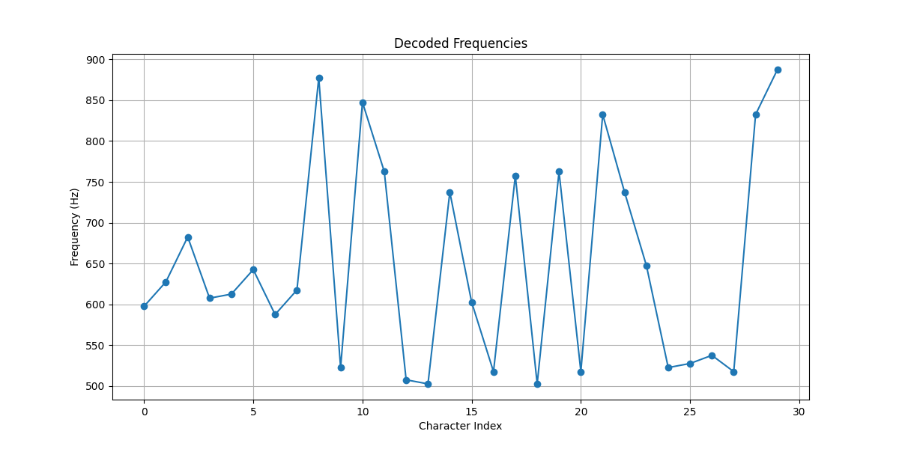

# Nota

**Description**

We intercepted this strange audio file from a suspected agent. It sounds like a simple melody, but our intelligence suggests it contains a hidden message.

> Your mission is to analyze the audio and extract the secret information.
> The melody may sound innocent, but hidden frequencies never lie.


**🎯 Flag Format**: `CITEFLAG{...}`


https://www.mediafire.com/file/9cwhm1kgx2l6amj/nota.wav/file


---

**👤 Author:** *Reo-0x*

---

## Challenge Objectives

objectifs:

1. Analyze the melody from the `flag_melody.wav` audio file.
2. Identify the method used to encode data into audio tones.
3. Recover the flag by reverse-engineering the encoding logic.

---

## Initial Clues

begin with only an audio file.

Upon listening,  notice:

* A series of short, distinct musical tones.
* Uniform rhythm: each note lasts about **0.4 seconds**, followed by a **short pause** (\~0.1s).
* Tones are clean and appear to be pure sine waves.

This strongly hints at **frequency-based encoding** — likely using **tones to represent characters**.

---

## Step 1: Frequency Extraction

use **Audacity**, **Sonic Visualiser**, or Python to extract dominant frequencies using FFT (Fast Fourier Transform).

write a script:

```python
from scipy.io.wavfile import read
import numpy as np

rate, data = read("flag_melody.wav")
if len(data.shape) > 1:
    data = data[:, 0]  # mono

note_duration = 0.4  # seconds
pause = 0.1
segment = int(rate * note_duration)
stride = int(rate * (note_duration + pause))

frequencies = []

for i in range(0, len(data) - segment, stride):
    slice = data[i:i+segment]
    fft = np.fft.rfft(slice)
    freqs = np.fft.rfftfreq(len(slice), d=1/rate)
    peak = freqs[np.argmax(np.abs(fft))]
    frequencies.append(round(peak, 2))
```

---

## Step 2: Observing the Pattern

Once lists the frequencies,  notice:

* Frequencies range from \~260 Hz to \~500 Hz
* The spacing between frequencies is **exactly 5 Hz**
* The lowest frequency is **261.63 Hz** (Middle C, a musical note)

This suggests a linear formula:

```
freq = base_freq + ascii_value * step
```

Where:

* `base_freq ≈ 261.63`
* `step = 5 Hz`
* Reverse: `ascii = round((freq - base_freq) / step)`

---

## Step 3: Decoding Characters

Using the reverse formula:

```python
base_freq = 261.63
step = 5

decoded = ''.join([chr(round((f - base_freq) / step)) for f in frequencies])
```

This produces readable ASCII — the hidden message is revealed as the flag.

---

## Final Flag

After decoding all frequencies and reconstructing the message:

```
CITEFLAG{4ud10_D3c0d3r_M4573r}
```


---

## Challenge Summary

| Property            | Value                                 |
| ------------------- | ------------------------------------- |
| Encoding Method     | Frequency shift                       |
| Note Duration       | 0.4s                                  |
| Pause Between Notes | 0.1s                                  |
| Base Frequency      | 261.63 Hz (C4)                        |
| Step Between Notes  | 5 Hz                                  |
| Encoding Formula    | `freq = base + ascii * step`          |
| Decoding Formula    | `ascii = round((freq - base) / step)` |

---


