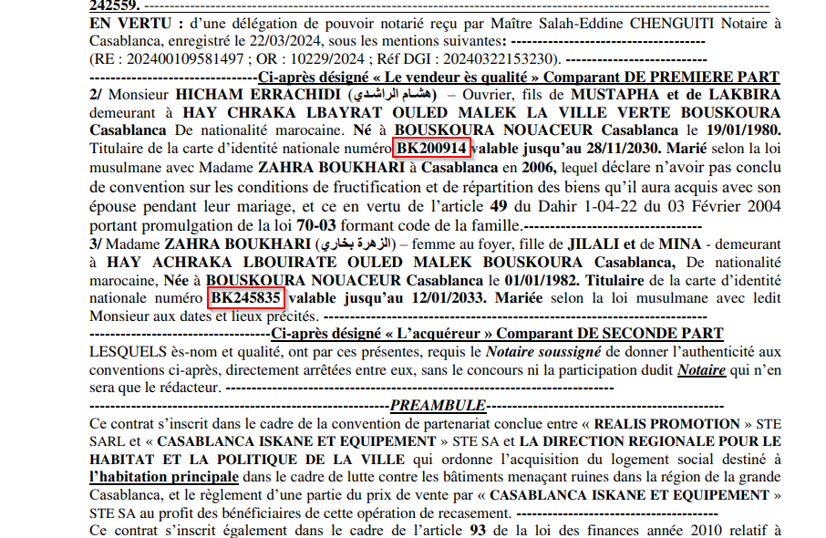

**Description**

On June 2, 2025, hackers breached a Moroccan public agency and leaked its database. Among the files is a notarial deed for a property sale finalized on May 28, 2025, referencing power-of-attorney number **202400109581497**

> Your mission is to sift through the dump, locate that deed entry, and extract both purchasers CNIE numbers and the date of sale

**Flag Format**

```
CITEFLAG{CNIE1_CNIE2-YYYY-MM-DD}
```

**👤 Author** *xtle0o0*

---

## Solution

The challenge name "ANCFCC" and the description reference a hack that allegedly occurred on June 2, 2025. Our objective is to find the CNIE (Moroccan National ID) numbers of two persons involved in a property sale referencing power-of-attorney number "202400109581497".

### Step 1: Information Gathering

Using Google dorking to search for Telegram channels containing the leaked data:

```
ancfcc leak site:t.me
```

This search leads us to discover a Telegram channel with the leaked data.


### Step 2: Accessing the Data Source

The search reveals a Telegram channel: https://t.me/ANCFCC_LEAKS


### Step 3: Data Analysis

After downloading the first ZIP file from the channel, we search for the specific power-of-attorney number "202400109581497". This search yields several PDF documents, with the first one containing our target information.


### Step 4: Document Examination

Opening the relevant PDF reveals the notarial deed with the required information:




### Step 5: Flag Extraction

From the document, we can extract:
- **First CNIE**: BK200914
- **Second CNIE**: BK245835  
- **Sale Date**: 2025-05-28

### Final Answer

The challenge accepts 2 flags :
- `CITEFLAG{BK200914_BK245835-2025-05-28}`
- `CITEFLAG{BK245835_BK200914-2025-05-28}`

