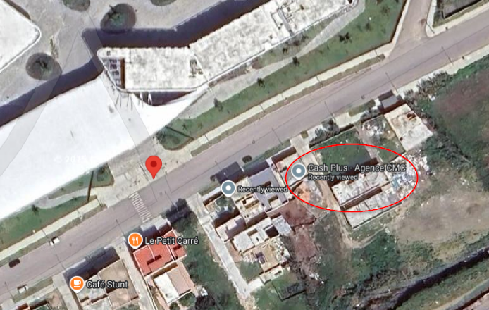

**Description**

Find the place in the image it looks insane but it's solvable ,don't get fooled or dragged down the rabbit hole

note: chlo7 nas mzyanin ma 3andna m3ahom walo hhhhhhhhh , ra gha challenge hada !!!!!!

**Flag Format:**

```
CITEFLAG{...}
```

---

**👤 Authors:** *Npc's*

---

## Solution

This challenge involved finding a specific location based on clues hidden within an image. The key was avoiding the deliberate misdirection and finding the real clue.

### Step 1: Metadata Analysis 

Initial analysis of the image metadata reveals a YouTube link, but this is intentionally placed as a **rabbit hole** to mislead participants.


### Step 2: Finding the Real Clue

The actual solution involves extracting a hidden **Pastebin URL** embedded at the end of the image file.


### Step 3: Following the Instructions

The Pastebin contains specific instructions that lead to **CMC Tanger**


The crucial hint from the paste states:
> "Then look around you — the flag might be next to you, to your left or right, or maybe behind you or in front of you."

### Step 4: Location Reconnaissance

Based on the instruction to "look around" CMC Tanger, we perform reconnaissance of nearby locations. This reveals a **Cash Plus agency**.




