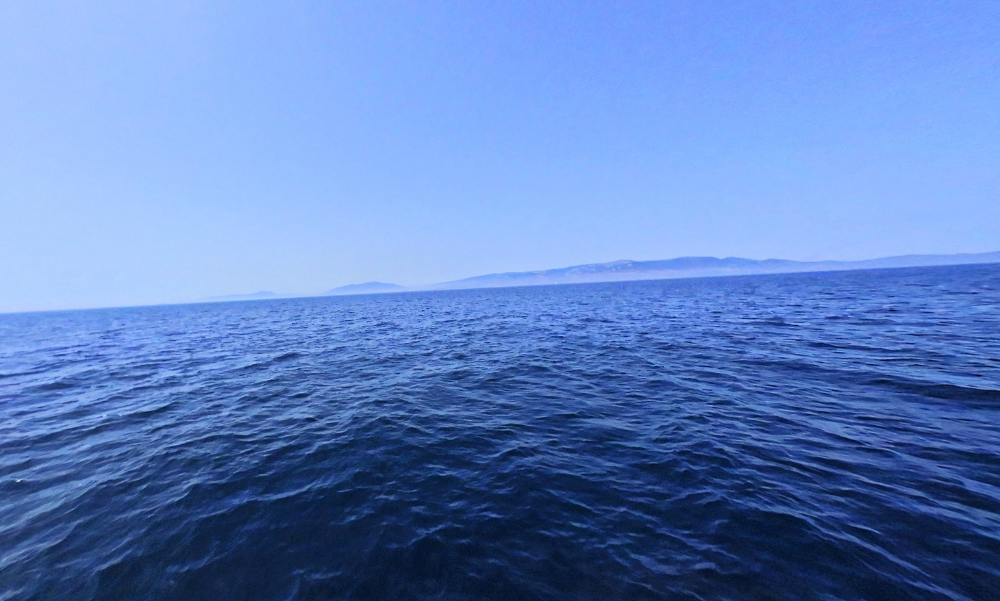
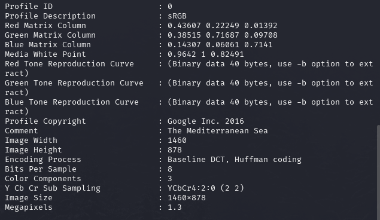
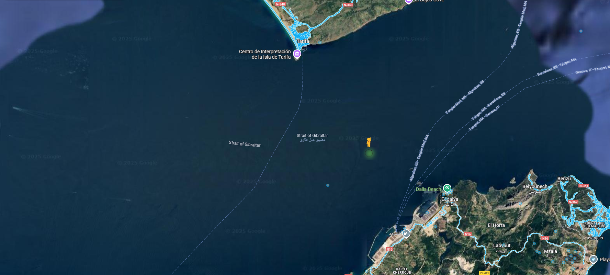
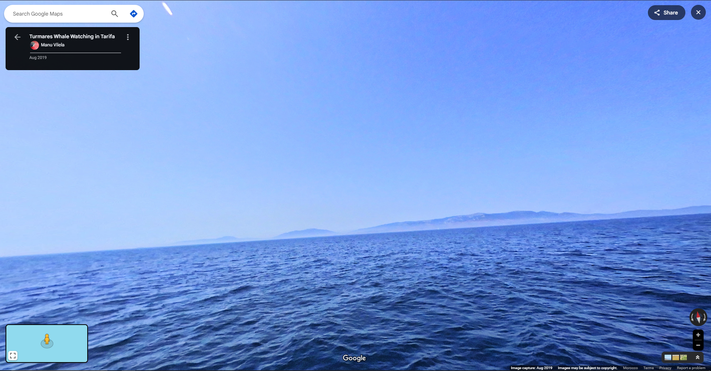

**Description**  

Someone took this image from the middle of the sea — can you figure out who?

**🎯 Flag Format**: `CITEFLAG{FirstName_LastName}`  

---

**👤 Authors:** Reo-0x  

---

The image provided:  

Looking at the image we can see some land, so it's close to coast.  

Check metadata using `exiftool`:  
  

📌 **Comment**: "The Mediterranean Sea"  
This suggests the image was likely taken somewhere in the Mediterranean region.  
By combining the landmass visible in the image with the hint from the EXIF data, let's open Google Maps and see:

Check and...

You can find the same view in the image — it was taken by **Manu Vilela**.

🟩 **Flag**: `CITEFLAG{Manu_Vilela}`
