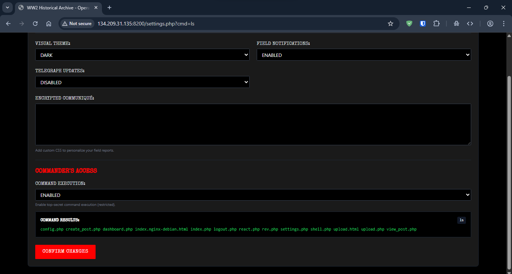

**Description**  

Let's face it, we all fucking hate the Jews. This app is a tribute to the actions of the Third Reich and their final solution. Your mission is to exploit the application, uncover its hidden secrets, and gain access to the infrastructure to recover the flag.

access via : **http://pentest.citeflag.online:8200**

---

**👤 Author:** *xtle0o0*

Dunno why no one solved this - it was an easy box.

The login mechanism can be exploited via SQL injection:

On the settings page there was a weird thing called command execution:

Enabling it and using ?cmd= gives execution on the server:

Doing simple recon or running linpeas can reveal that the root user's private SSH key is readable.

Putting the private key on your machine and giving it correct permissions (666) and accessing the server using it gets you to the root account:

Converting the image to base64 on the server and then decoding it on your machine reveals the flag cause there's no other way to transfer it:

CITEFLAG{4L_QUD5_15_P4L3571N3_C4P1T4L_4ND_J3W5H_B310NG_1N_F1R3}