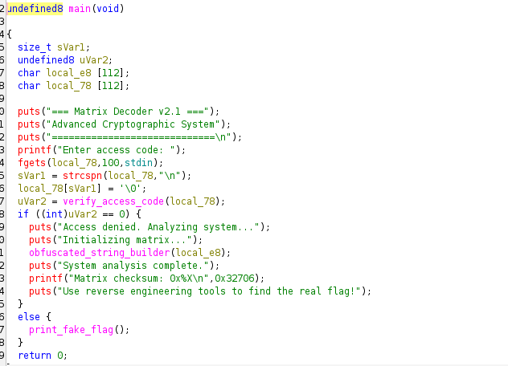
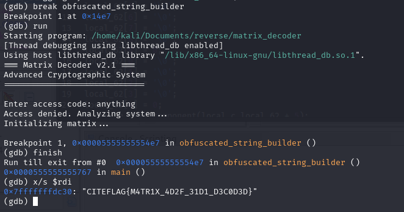

# matrix decoder 

**Description**  

An advanced cryptographic system hides its output behind layers of obfuscation and misleading logic. Your mission is to dissect the binary, uncover the real execution path, and extract the true flag hidden deep within the matrix operations. Beware of red herrings.

**🎯 Flag Format**: `CITEFLAG{...}`  

---

**👤 Author:** *Reo-0x*

---

## Analysis

Upon decompiling the binary, we observe that the function verify_access_code() validates the input. If the check fails, the program calls obfuscated_string_builder() with a local buffer

This function builds the real flag, using:

initialize_matrix(): Fills data buffer.

calculate_checksum(): computes a hash from the buffer.

generate_flag_component(): Uses the checksum to generate two parts of the flag.

## Exploitation

Flag : CITEFLAG{M4TR1X_4D2F_31D1_D3C0D3D}