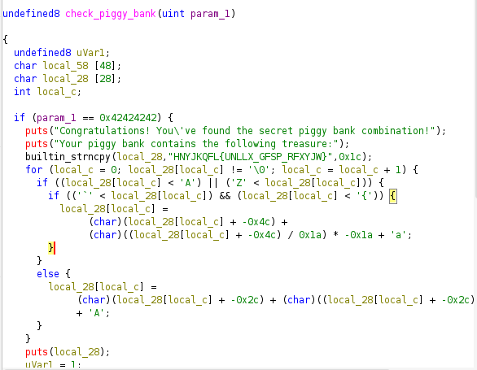
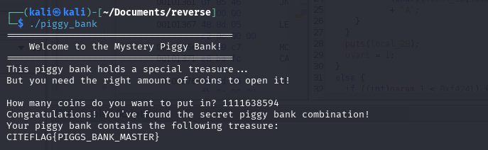

# Piggy Bank🐷

**Description**  
You've discovered an old piggy bank program that claims to hold a special treasure! The program asks you to deposit coins, but it seems like there's a specific amount needed to unlock the secret.

---  

**Flag Format**: `CITEFLAG{...}`  

---

**Author:** *Reo-0x*

---
## disassembly
open ghidra and an let disassembly the programme 

while the anaylyse we found the check_piggy_bank() and the right input is 0x42424242 in decimal then the app return the flag as we see in the ghidra it encrypted whit ROT13

flag : CITEFLAG{PIGGS_BANK_MASTER}