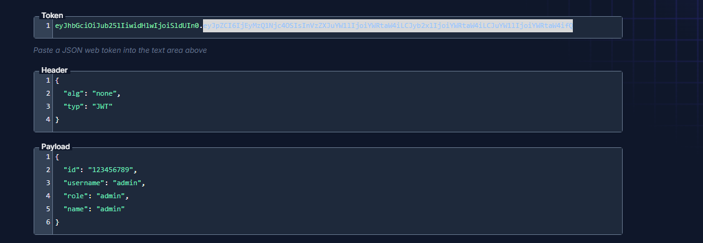
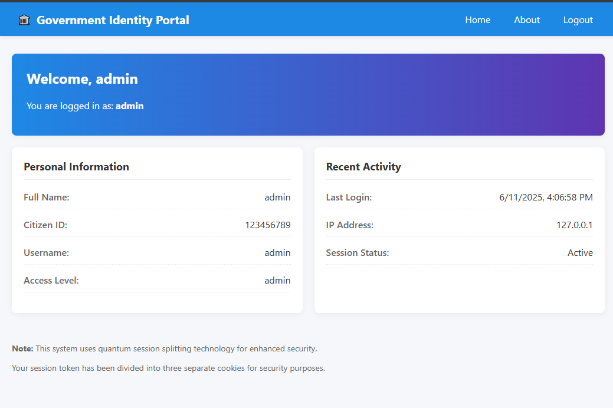
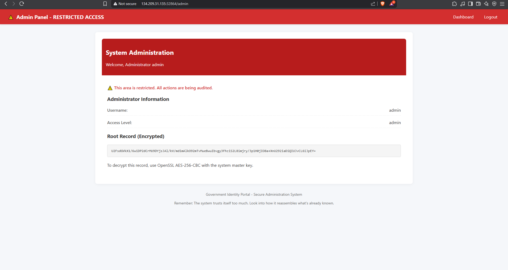

# Session Splinter

**Description**

You are investigating a suspicious government portal that handles citizen identity card data. The front-end looks secure, but the admin panel is hidden behind a **"quantum session splitting"** mechanism.

> A whistleblower left a hint:
> **"The system trusts itself too much. Look into how it reassembles what's already known."**

Your goal is to become **Administrator** to access the `/admin` panel and retrieve the **encrypted root record**.


**🔗 Challenge Access**  → [🌐 http://134.209.31.135:32864](http://134.209.31.135:32864)
---

**Flag Format**: `CITEFLAG{...}`

---

**Author**: *Reo-0x*

---

## Step 1: Gathering Information

From the `/about` page, we discover the hint:

> **"All secrets start with 🇲🇦 + 2025"**

This suggests the JWT secret is derived from `🇲🇦 + 2025`, but since we're using the **`none` algorithm**, we don't need the secret now!

---

## Step 2: Create a Malicious Token

 Create a malicious JWT token with the `alg` set to `none`.

 


 Change it in the browser's session/cookie. Refresh the page — you're now **admin**!

 


access to admin route 


 

---

## Step 3: Decrypt the Encrypted Flag

From the source code and the secret key found (🇲🇦 + 2025), let's craft a script to decrypt the encrypted flag.

### Decryption Script

```javascript
const CryptoJS = require('crypto-js');

const encryptedFlag = 'U2FsdGVkX1+FzQtuBqK+2NBbStbBV5qDPXS1uBkeh/Xnq3ZM4eeA5SOqCeoW/bLZHfG85xVtEtP07WaoSvy95g==';
const secretKey = CryptoJS.SHA256('🇲🇦 + 2025').toString();

const decrypted = CryptoJS.AES.decrypt(encryptedFlag, secretKey).toString(CryptoJS.enc.Utf8);
console.log(decrypted);
```

---

## ✅ Final Flag

```
CITEFLAG{jwt_none_alg_cache_poison_ftwc0049f1aae45}
```

---
